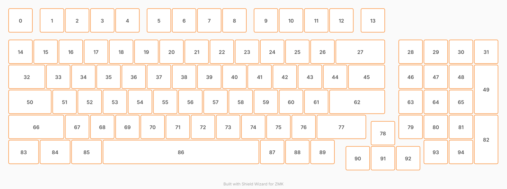

# ZMK Configuration for starboy

*Generated by Shield Wizard for ZMK*



Download compiled firmware from the Actions tab. <https://zmk.dev/docs/user-setup#installing-the-firmware>

Edit your keymap <https://zmk.dev/docs/keymaps>.
User keymap is located at [`config/starboy.keymap`](config/starboy.keymap).

-----

<details>
<summary>
Shield Wizard Debug Information
</summary>

In case of broken configuration, here is the Shield Wizard internal data used to generate this configuration:

Commit: e017133190ed33735e73a79d2bf21127099c0d02

```json
{"name":"starboy","shield":"starboy","dongle":false,"modules":[],"layout":[{"id":"01M0CDKDAWVBHHCTY7BACXQ9P8","part":0,"row":0,"col":0,"w":1,"h":1,"x":0,"y":0,"r":0,"rx":0,"ry":0},{"id":"01M0CDKEETDNJZPH1SQR96JNSH","part":0,"row":0,"col":1,"w":1,"h":1,"x":1.25,"y":0,"r":0,"rx":0,"ry":0},{"id":"01M0CDKESMN3BGF3Y7T7NYFWTT","part":0,"row":0,"col":2,"w":1,"h":1,"x":2.25,"y":0,"r":0,"rx":0,"ry":0},{"id":"01M0CDKEYZRTMXTP1CY3WSW6ZJ","part":0,"row":0,"col":3,"w":1,"h":1,"x":3.25,"y":0,"r":0,"rx":0,"ry":0},{"id":"01M0CDKF3W0511ZQR61B1CY4NB","part":0,"row":0,"col":4,"w":1,"h":1,"x":4.25,"y":0,"r":0,"rx":0,"ry":0},{"id":"01M0CDKF8ZC6EQG6KCNTWB04W8","part":0,"row":0,"col":5,"w":1,"h":1,"x":5.5,"y":0,"r":0,"rx":0,"ry":0},{"id":"01M0CDKFE34X87ZR9SSRMM6HMK","part":0,"row":0,"col":6,"w":1,"h":1,"x":6.5,"y":0,"r":0,"rx":0,"ry":0},{"id":"01M0CDKY38VN50D6DB7JENPXK1","part":0,"row":0,"col":7,"w":1,"h":1,"x":7.5,"y":0,"r":0,"rx":0,"ry":0},{"id":"01M0CDKYZ3G02C5KN1EFXWVTYT","part":0,"row":0,"col":8,"w":1,"h":1,"x":8.5,"y":0,"r":0,"rx":0,"ry":0},{"id":"01M0CDKZ50Q95KYNHBQT1ASCZ0","part":0,"row":0,"col":9,"w":1,"h":1,"x":9.75,"y":0,"r":0,"rx":0,"ry":0},{"id":"01M0CDKZA3MVW3SNDVM9EWEF7B","part":0,"row":0,"col":10,"w":1,"h":1,"x":10.75,"y":0,"r":0,"rx":0,"ry":0},{"id":"01M0CDKZGFT3P007RKPEZ03FJC","part":0,"row":0,"col":11,"w":1,"h":1,"x":11.75,"y":0,"r":0,"rx":0,"ry":0},{"id":"01M0CDKZPVKP4XPDWG5ERSEKM1","part":0,"row":0,"col":12,"w":1,"h":1,"x":12.75,"y":0,"r":0,"rx":0,"ry":0},{"id":"01M0CDM06Z75D36RQF96XAYXFN","part":0,"row":0,"col":13,"w":1,"h":1,"x":14,"y":0,"r":0,"rx":0,"ry":0},{"id":"01M0CDM0DVZ1BM8T45FHYRMYAM","part":0,"row":1,"col":0,"w":1,"h":1,"x":0,"y":1.25,"r":0,"rx":0,"ry":0},{"id":"01M0CDNDZVX0X43Y2861BHJN9W","part":0,"row":1,"col":1,"w":1,"h":1,"x":1,"y":1.25,"r":0,"rx":0,"ry":0},{"id":"01M0CDNJJKCNMY2NZP7NHZA1BZ","part":0,"row":1,"col":2,"w":1,"h":1,"x":2,"y":1.25,"r":0,"rx":0,"ry":0},{"id":"01M0CDNK5NJB8BQ7RWT03RM2CR","part":0,"row":1,"col":3,"w":1,"h":1,"x":3,"y":1.25,"r":0,"rx":0,"ry":0},{"id":"01M0CDNKH5D9KJK0S83J48P60D","part":0,"row":1,"col":4,"w":1,"h":1,"x":4,"y":1.25,"r":0,"rx":0,"ry":0},{"id":"01M0CDNWMV32VPPAM2JTDCB33Q","part":0,"row":1,"col":5,"w":1,"h":1,"x":5,"y":1.25,"r":0,"rx":0,"ry":0},{"id":"01M0CDNX130QWRC57EAP24SAT5","part":0,"row":1,"col":6,"w":1,"h":1,"x":6,"y":1.25,"r":0,"rx":0,"ry":0},{"id":"01M0CDNX8NA5SEQACN29P5V9VY","part":0,"row":1,"col":7,"w":1,"h":1,"x":7,"y":1.25,"r":0,"rx":0,"ry":0},{"id":"01M0CDRQ9R3XBWFJMY2SE4YQDY","part":0,"row":1,"col":8,"w":1,"h":1,"x":8,"y":1.25,"r":0,"rx":0,"ry":0},{"id":"01M0CDRQRYGFR5T624N588R0TN","part":0,"row":1,"col":9,"w":1,"h":1,"x":9,"y":1.25,"r":0,"rx":0,"ry":0},{"id":"01M0CDRR2YNRDW3Y9DKW2X2YHY","part":0,"row":1,"col":10,"w":1,"h":1,"x":10,"y":1.25,"r":0,"rx":0,"ry":0},{"id":"01M0CDT23PHANH0FWFAT7F0YZQ","part":0,"row":1,"col":11,"w":1,"h":1,"x":11,"y":1.25,"r":0,"rx":0,"ry":0},{"id":"01M0CDT2G4CZM99H0VFKJ4PXMT","part":0,"row":1,"col":12,"w":1,"h":1,"x":12,"y":1.25,"r":0,"rx":0,"ry":0},{"id":"01M0CDTWFG7K3ECZS4G4R2N8D4","part":0,"row":1,"col":13,"w":2,"h":1,"x":13,"y":1.25,"r":0,"rx":0,"ry":0},{"id":"01M0CDVH1AZQ40764JDQW8A3R5","part":0,"row":1,"col":14,"w":1,"h":1,"x":15.5,"y":1.25,"r":0,"rx":0,"ry":0},{"id":"01M0CDWC28FM08AND3CE553PMP","part":0,"row":1,"col":15,"w":1,"h":1,"x":16.5,"y":1.25,"r":0,"rx":0,"ry":0},{"id":"01M0CDWJJHVR0TKSJHEQ1FNQ1W","part":0,"row":1,"col":16,"w":1,"h":1,"x":17.5,"y":1.25,"r":0,"rx":0,"ry":0},{"id":"01M0CDWKVET1TJZD7GWAWXC3GB","part":0,"row":1,"col":17,"w":1,"h":1,"x":18.5,"y":1.25,"r":0,"rx":0,"ry":0},{"id":"01M0CDWTTYSNXPEEWJ0MPZ8T95","part":0,"row":2,"col":0,"w":1.5,"h":1,"x":0,"y":2.25,"r":0,"rx":0,"ry":0},{"id":"01M0CDWV8CVT09HKZ0ET9G3BPP","part":0,"row":2,"col":1,"w":1,"h":1,"x":1.5,"y":2.25,"r":0,"rx":0,"ry":0},{"id":"01M0CDWVD8S30P4VNJEEPECQHF","part":0,"row":2,"col":2,"w":1,"h":1,"x":2.5,"y":2.25,"r":0,"rx":0,"ry":0},{"id":"01M0CDWVJBFPFRZ25PV5W35Y3D","part":0,"row":2,"col":3,"w":1,"h":1,"x":3.5,"y":2.25,"r":0,"rx":0,"ry":0},{"id":"01M0CDWVP9165QC67MM80H01H9","part":0,"row":2,"col":4,"w":1,"h":1,"x":4.5,"y":2.25,"r":0,"rx":0,"ry":0},{"id":"01M0CDWVTNHHK9HRHXBJFRX3P2","part":0,"row":2,"col":5,"w":1,"h":1,"x":5.5,"y":2.25,"r":0,"rx":0,"ry":0},{"id":"01M0CDWVYWX667KE3NN3FGJFDJ","part":0,"row":2,"col":6,"w":1,"h":1,"x":6.5,"y":2.25,"r":0,"rx":0,"ry":0},{"id":"01M0CDWW38BJ8W3XZJ3KBZXWK6","part":0,"row":2,"col":7,"w":1,"h":1,"x":7.5,"y":2.25,"r":0,"rx":0,"ry":0},{"id":"01M0CDWW7PP8NPPPT5J0K5706M","part":0,"row":2,"col":8,"w":1,"h":1,"x":8.5,"y":2.25,"r":0,"rx":0,"ry":0},{"id":"01M0CDWWCJYEYC2R678S0RT3XQ","part":0,"row":2,"col":9,"w":1,"h":1,"x":9.5,"y":2.25,"r":0,"rx":0,"ry":0},{"id":"01M0CDWWHNAQ1ZSG5T6WG64BFT","part":0,"row":2,"col":10,"w":1,"h":1,"x":10.5,"y":2.25,"r":0,"rx":0,"ry":0},{"id":"01M0CDWWNVQR9PG0W0P1TF9QDW","part":0,"row":2,"col":11,"w":1,"h":1,"x":11.5,"y":2.25,"r":0,"rx":0,"ry":0},{"id":"01M0CDXP427V722BFCBCQ7ZSE2","part":0,"row":2,"col":12,"w":1,"h":1,"x":12.5,"y":2.25,"r":0,"rx":0,"ry":0},{"id":"01M0CDXP960ADMJQZGX5W6KSW1","part":0,"row":2,"col":13,"w":1.5,"h":1,"x":13.5,"y":2.25,"r":0,"rx":0,"ry":0},{"id":"01M0CDXPXFZBF4K78331BXVYBC","part":0,"row":2,"col":14,"w":1,"h":1,"x":15.5,"y":2.25,"r":0,"rx":0,"ry":0},{"id":"01M0CDXQ2CGQEWF6WJC8EDVSEY","part":0,"row":2,"col":15,"w":1,"h":1,"x":16.5,"y":2.25,"r":0,"rx":0,"ry":0},{"id":"01M0CDXQ79D04HPRCPGMCNQQX9","part":0,"row":2,"col":16,"w":1,"h":1,"x":17.5,"y":2.25,"r":0,"rx":0,"ry":0},{"id":"01M0CDXQFWWRD00JZ0ZEY9PMVF","part":0,"row":2,"col":17,"w":1,"h":2,"x":18.5,"y":2.25,"r":0,"rx":0,"ry":0},{"id":"01M0CDZTH7QQ2BZQKPYEZBFTJ0","part":0,"row":3,"col":0,"w":1.75,"h":1,"x":0,"y":3.25,"r":0,"rx":0,"ry":0},{"id":"01M0CDZV1X1VN1554AHK8YQY44","part":0,"row":3,"col":1,"w":1,"h":1,"x":1.75,"y":3.25,"r":0,"rx":0,"ry":0},{"id":"01M0CDZV8ZJ1HWX2Y5CA7DRN6G","part":0,"row":3,"col":2,"w":1,"h":1,"x":2.75,"y":3.25,"r":0,"rx":0,"ry":0},{"id":"01M0CDZVDK7NT8XC5CDGJYSS4W","part":0,"row":3,"col":3,"w":1,"h":1,"x":3.75,"y":3.25,"r":0,"rx":0,"ry":0},{"id":"01M0CDZVJZAT1FQ5XHGQKW6NRH","part":0,"row":3,"col":4,"w":1,"h":1,"x":4.75,"y":3.25,"r":0,"rx":0,"ry":0},{"id":"01M0CDZVQNC8RMAER8F8RTXMNG","part":0,"row":3,"col":5,"w":1,"h":1,"x":5.75,"y":3.25,"r":0,"rx":0,"ry":0},{"id":"01M0CDZVX9WWY0ZZAJEK2VZCMT","part":0,"row":3,"col":6,"w":1,"h":1,"x":6.75,"y":3.25,"r":0,"rx":0,"ry":0},{"id":"01M0CDZW2NGY1PA36X1Y17H9YH","part":0,"row":3,"col":7,"w":1,"h":1,"x":7.75,"y":3.25,"r":0,"rx":0,"ry":0},{"id":"01M0CDZW8HPZNVFM7MRDF6R31E","part":0,"row":3,"col":8,"w":1,"h":1,"x":8.75,"y":3.25,"r":0,"rx":0,"ry":0},{"id":"01M0CDZWD5RNSX4DY94EJCNS7H","part":0,"row":3,"col":9,"w":1,"h":1,"x":9.75,"y":3.25,"r":0,"rx":0,"ry":0},{"id":"01M0CDZWJ9JMHPGT1QX2SFAGKE","part":0,"row":3,"col":10,"w":1,"h":1,"x":10.75,"y":3.25,"r":0,"rx":0,"ry":0},{"id":"01M0CDZWPZR0X4Y2QAFN5K95XH","part":0,"row":3,"col":11,"w":1,"h":1,"x":11.75,"y":3.25,"r":0,"rx":0,"ry":0},{"id":"01M0CE0T75DB7SWHGSD8JKVWJT","part":0,"row":3,"col":12,"w":2.25,"h":1,"x":12.75,"y":3.25,"r":0,"rx":0,"ry":0},{"id":"01M0CE0TBVWDYHMMAF3JC8DV3T","part":0,"row":3,"col":13,"w":1,"h":1,"x":15.5,"y":3.25,"r":0,"rx":0,"ry":0},{"id":"01M0CE1K2NQCCA26SFX77C4ND6","part":0,"row":3,"col":14,"w":1,"h":1,"x":16.5,"y":3.25,"r":0,"rx":0,"ry":0},{"id":"01M0CE1K736Y6TFQYK4J7NEWPR","part":0,"row":3,"col":15,"w":1,"h":1,"x":17.5,"y":3.25,"r":0,"rx":0,"ry":0},{"id":"01M0CE1RS2MG7V51HFEBZM41A4","part":0,"row":4,"col":0,"w":2.25,"h":1,"x":0,"y":4.25,"r":0,"rx":0,"ry":0},{"id":"01M0CE1SA79XRKR0NJJXEJVTFJ","part":0,"row":4,"col":1,"w":1,"h":1,"x":2.25,"y":4.25,"r":0,"rx":0,"ry":0},{"id":"01M0CE1SFBFYJ9BT4Q2PWRPW8H","part":0,"row":4,"col":2,"w":1,"h":1,"x":3.25,"y":4.25,"r":0,"rx":0,"ry":0},{"id":"01M0CE1SPFPKY2RF6ZNZ0ND2K8","part":0,"row":4,"col":3,"w":1,"h":1,"x":4.25,"y":4.25,"r":0,"rx":0,"ry":0},{"id":"01M0CE1SVA6Y8X14MA8C8W9BC6","part":0,"row":4,"col":4,"w":1,"h":1,"x":5.25,"y":4.25,"r":0,"rx":0,"ry":0},{"id":"01M0CE1T16ZN8GW07KEZ2W62ZS","part":0,"row":4,"col":5,"w":1,"h":1,"x":6.25,"y":4.25,"r":0,"rx":0,"ry":0},{"id":"01M0CE1YV3PN2WZ29E0WBVQERR","part":0,"row":4,"col":6,"w":1,"h":1,"x":7.25,"y":4.25,"r":0,"rx":0,"ry":0},{"id":"01M0CE1Z0EBXR58A5QWKKJCDNX","part":0,"row":4,"col":7,"w":1,"h":1,"x":8.25,"y":4.25,"r":0,"rx":0,"ry":0},{"id":"01M0CE1Z5TMB96ACQSTM1JNRMW","part":0,"row":4,"col":8,"w":1,"h":1,"x":9.25,"y":4.25,"r":0,"rx":0,"ry":0},{"id":"01M0CE1ZB75NQQGH3JVAH7A6G5","part":0,"row":4,"col":9,"w":1,"h":1,"x":10.25,"y":4.25,"r":0,"rx":0,"ry":0},{"id":"01M0CE1ZH3Z9088K8RD025SZZV","part":0,"row":4,"col":10,"w":1,"h":1,"x":11.25,"y":4.25,"r":0,"rx":0,"ry":0},{"id":"01M0CE1ZPYNM03M598AGEPR2ND","part":0,"row":4,"col":11,"w":2,"h":1,"x":12.25,"y":4.25,"r":0,"rx":0,"ry":0},{"id":"01M0CE3HV2MTG5YYY85TG2Q524","part":0,"row":4,"col":12,"w":1,"h":1,"x":14.4,"y":4.5,"r":0,"rx":0,"ry":0},{"id":"01M0CE4GJJ2W5WGGEGXQQ1N6JA","part":0,"row":4,"col":13,"w":1,"h":1,"x":15.5,"y":4.25,"r":0,"rx":0,"ry":0},{"id":"01M0CE4GRC3VK33VJCEWQZYF9H","part":0,"row":4,"col":14,"w":1,"h":1,"x":16.5,"y":4.25,"r":0,"rx":0,"ry":0},{"id":"01M0CE4GZ0TYP4MBDC37CJB2D2","part":0,"row":4,"col":15,"w":1,"h":1,"x":17.5,"y":4.25,"r":0,"rx":0,"ry":0},{"id":"01M0CE4HJJYBVM50E72CNND2B1","part":0,"row":5,"col":0,"w":1,"h":2,"x":18.5,"y":4.25,"r":0,"rx":0,"ry":0},{"id":"01M0CE4YCWPM1WJXS6FE55E3A8","part":0,"row":5,"col":1,"w":1.25,"h":1,"x":0,"y":5.25,"r":0,"rx":0,"ry":0},{"id":"01M0CE4YJ8WDRYACETB5T55XTA","part":0,"row":5,"col":2,"w":1.25,"h":1,"x":1.25,"y":5.25,"r":0,"rx":0,"ry":0},{"id":"01M0CE4YS2CYGDVW2GSTDA2YHK","part":0,"row":5,"col":3,"w":1.25,"h":1,"x":2.5,"y":5.25,"r":0,"rx":0,"ry":0},{"id":"01M0CE4Z0E6PW3YVXR3WRSW5PC","part":0,"row":5,"col":4,"w":6.25,"h":1,"x":3.75,"y":5.25,"r":0,"rx":0,"ry":0},{"id":"01M0CE4ZMY2SRQ7PH0N93V18H6","part":0,"row":5,"col":5,"w":1,"h":1,"x":10,"y":5.25,"r":0,"rx":0,"ry":0},{"id":"01M0CE4ZX2VJMQCKZJBDFA5ADC","part":0,"row":5,"col":6,"w":1,"h":1,"x":11,"y":5.25,"r":0,"rx":0,"ry":0},{"id":"01M0CE505TJQTS63C5MN4P8G1W","part":0,"row":5,"col":7,"w":1,"h":1,"x":12,"y":5.25,"r":0,"rx":0,"ry":0},{"id":"01M0CE78R0JVPT9KZ5BQEPT1B6","part":0,"row":5,"col":8,"w":1,"h":1,"x":13.4,"y":5.5,"r":0,"rx":0,"ry":0},{"id":"01M0CE78X41SQ4PYB3P0Q9RY96","part":0,"row":5,"col":9,"w":1,"h":1,"x":14.4,"y":5.5,"r":0,"rx":0,"ry":0},{"id":"01M0CE791A8FCY0EJH8Q7VDCA7","part":0,"row":5,"col":10,"w":1,"h":1,"x":15.4,"y":5.5,"r":0,"rx":0,"ry":0},{"id":"01M0CE7FJWVWBN7AFP0Z1DKCQX","part":0,"row":5,"col":11,"w":1,"h":1,"x":16.5,"y":5.25,"r":0,"rx":0,"ry":0},{"id":"01M0CE7FQFXY0BCN7HX2T1HSPS","part":0,"row":5,"col":12,"w":1,"h":1,"x":17.5,"y":5.25,"r":0,"rx":0,"ry":0}],"parts":[{"name":"unibody","controller":"nice_nano_v2","pins":{"d20":{"usage":"bus","bus":"spi0","role":"sck"},"d19":{"usage":"bus","bus":"spi0","role":"mosi"},"d21":{"usage":"device","deviceId":"01M0CESEHQYRYEA4WK98TE6F80","role":"cs"},"d18":{"usage":"encoder","encoderId":"01M0CEQYQ7F3WQKR75Y8YREX7K","role":"pinA"},"d15":{"usage":"encoder","encoderId":"01M0CEQYQ7F3WQKR75Y8YREX7K","role":"pinB"},"d1":{"usage":"kscan","kscan":"01M0CEQJ5GSQX1STTJEFA3WT53","role":"input"},"d9":{"usage":"kscan","kscan":"01M0CEQJ5GSQX1STTJEFA3WT53","role":"input"},"d8":{"usage":"kscan","kscan":"01M0CEQJ5GSQX1STTJEFA3WT53","role":"input"},"d7":{"usage":"kscan","kscan":"01M0CEQJ5GSQX1STTJEFA3WT53","role":"input"},"d6":{"usage":"kscan","kscan":"01M0CEQJ5GSQX1STTJEFA3WT53","role":"input"},"d5":{"usage":"kscan","kscan":"01M0CEQJ5GSQX1STTJEFA3WT53","role":"input"},"d4":{"usage":"kscan","kscan":"01M0CEQJ5GSQX1STTJEFA3WT53","role":"input"},"d3":{"usage":"kscan","kscan":"01M0CEQJ5GSQX1STTJEFA3WT53","role":"input"},"d10":{"usage":"kscan","kscan":"01M0CEQJ5GSQX1STTJEFA3WT53","role":"input"},"d16":{"usage":"kscan","kscan":"01M0CEQJ5GSQX1STTJEFA3WT53","role":"input"},"d0":{"usage":"kscan","kscan":"01M0CEQJ5GSQX1STTJEFA3WT53","role":"input"},"d2":{"usage":"kscan","kscan":"01M0CEQJ5GSQX1STTJEFA3WT53","role":"input"},"d14":{"usage":"kscan","kscan":"01M0CEQJ5GSQX1STTJEFA3WT53","role":"input"},"p107":{"usage":"kscan","kscan":"01M0CEQJ5GSQX1STTJEFA3WT53","role":"input"},"p102":{"usage":"kscan","kscan":"01M0CEQJ5GSQX1STTJEFA3WT53","role":"input"},"p101":{"usage":"kscan","kscan":"01M0CEQJ5GSQX1STTJEFA3WT53","role":"input"}},"kscans":[{"kind":"charlieplex","id":"01M0CEQJ5GSQX1STTJEFA3WT53"}],"keys":{"01M0CDKFE34X87ZR9SSRMM6HMK":{"input":"d0","output":"d6"},"01M0CDKF8ZC6EQG6KCNTWB04W8":{"input":"d7","output":"d0"},"01M0CDKDAWVBHHCTY7BACXQ9P8":{"input":"d0","output":"d9"},"01M0CDM0DVZ1BM8T45FHYRMYAM":{"input":"d2","output":"d9"},"01M0CDWTTYSNXPEEWJ0MPZ8T95":{"input":"p101","output":"d9"},"01M0CDZTH7QQ2BZQKPYEZBFTJ0":{"input":"p102","output":"d9"},"01M0CE1RS2MG7V51HFEBZM41A4":{"input":"p107","output":"d9"},"01M0CE4YCWPM1WJXS6FE55E3A8":{"input":"d14","output":"d9"},"01M0CDKEETDNJZPH1SQR96JNSH":{"input":"d9","output":"d0"},"01M0CDNDZVX0X43Y2861BHJN9W":{"input":"d9","output":"d2"},"01M0CDWV8CVT09HKZ0ET9G3BPP":{"input":"d9","output":"p101"},"01M0CDZV1X1VN1554AHK8YQY44":{"input":"d9","output":"p102"},"01M0CE1SA79XRKR0NJJXEJVTFJ":{"input":"d9","output":"p107"},"01M0CE4YJ8WDRYACETB5T55XTA":{"input":"d9","output":"d14"},"01M0CDKEYZRTMXTP1CY3WSW6ZJ":{"input":"d8","output":"d0"},"01M0CDNK5NJB8BQ7RWT03RM2CR":{"input":"d8","output":"d2"},"01M0CDWVJBFPFRZ25PV5W35Y3D":{"input":"d8","output":"p101"},"01M0CDZVDK7NT8XC5CDGJYSS4W":{"input":"d8","output":"p102"},"01M0CE1SPFPKY2RF6ZNZ0ND2K8":{"input":"d8","output":"p107"},"01M0CE4YS2CYGDVW2GSTDA2YHK":{"input":"d14","output":"d8"},"01M0CE1SFBFYJ9BT4Q2PWRPW8H":{"input":"p107","output":"d8"},"01M0CDZV8ZJ1HWX2Y5CA7DRN6G":{"input":"p102","output":"d8"},"01M0CDWVD8S30P4VNJEEPECQHF":{"input":"p101","output":"d8"},"01M0CDNJJKCNMY2NZP7NHZA1BZ":{"input":"d2","output":"d8"},"01M0CDKESMN3BGF3Y7T7NYFWTT":{"input":"d0","output":"d8"},"01M0CDKF3W0511ZQR61B1CY4NB":{"input":"d0","output":"d7"},"01M0CDNKH5D9KJK0S83J48P60D":{"input":"d2","output":"d7"},"01M0CDWVP9165QC67MM80H01H9":{"input":"p101","output":"d7"},"01M0CDZVJZAT1FQ5XHGQKW6NRH":{"input":"p102","output":"d7"},"01M0CE1SVA6Y8X14MA8C8W9BC6":{"input":"p107","output":"d7"},"01M0CE4Z0E6PW3YVXR3WRSW5PC":{"input":"d7","output":"d14"},"01M0CE1T16ZN8GW07KEZ2W62ZS":{"input":"d7","output":"p107"},"01M0CDZVQNC8RMAER8F8RTXMNG":{"input":"d7","output":"p102"},"01M0CDWVTNHHK9HRHXBJFRX3P2":{"input":"d7","output":"p101"},"01M0CDNWMV32VPPAM2JTDCB33Q":{"input":"d7","output":"d2"},"01M0CDKY38VN50D6DB7JENPXK1":{"input":"d6","output":"d0"},"01M0CDNX8NA5SEQACN29P5V9VY":{"input":"d6","output":"d2"},"01M0CDWW38BJ8W3XZJ3KBZXWK6":{"input":"d6","output":"p101"},"01M0CDZW2NGY1PA36X1Y17H9YH":{"input":"d6","output":"p102"},"01M0CE1Z0EBXR58A5QWKKJCDNX":{"input":"d6","output":"p107"},"01M0CE1YV3PN2WZ29E0WBVQERR":{"input":"p107","output":"d6"},"01M0CDZVX9WWY0ZZAJEK2VZCMT":{"input":"p102","output":"d6"},"01M0CDWVYWX667KE3NN3FGJFDJ":{"input":"p101","output":"d6"},"01M0CDNX130QWRC57EAP24SAT5":{"input":"d2","output":"d6"},"01M0CE4ZMY2SRQ7PH0N93V18H6":{"input":"d14","output":"d5"},"01M0CE1Z5TMB96ACQSTM1JNRMW":{"input":"p107","output":"d5"},"01M0CDWW7PP8NPPPT5J0K5706M":{"input":"p101","output":"d5"},"01M0CDZW8HPZNVFM7MRDF6R31E":{"input":"p102","output":"d5"},"01M0CDRQ9R3XBWFJMY2SE4YQDY":{"input":"d2","output":"d5"},"01M0CDKYZ3G02C5KN1EFXWVTYT":{"input":"d0","output":"d5"},"01M0CDKZ50Q95KYNHBQT1ASCZ0":{"input":"d5","output":"d0"},"01M0CDRQRYGFR5T624N588R0TN":{"input":"d5","output":"d2"},"01M0CDWWCJYEYC2R678S0RT3XQ":{"input":"d5","output":"p101"},"01M0CDZWD5RNSX4DY94EJCNS7H":{"input":"d5","output":"p102"},"01M0CE1ZB75NQQGH3JVAH7A6G5":{"input":"d5","output":"p107"},"01M0CE4ZX2VJMQCKZJBDFA5ADC":{"input":"d5","output":"d14"},"01M0CE505TJQTS63C5MN4P8G1W":{"input":"d14","output":"d4"},"01M0CE1ZH3Z9088K8RD025SZZV":{"input":"p107","output":"d4"},"01M0CDZWJ9JMHPGT1QX2SFAGKE":{"input":"p102","output":"d4"},"01M0CDWWHNAQ1ZSG5T6WG64BFT":{"input":"p101","output":"d4"},"01M0CDRR2YNRDW3Y9DKW2X2YHY":{"input":"d2","output":"d4"},"01M0CDKZA3MVW3SNDVM9EWEF7B":{"input":"d0","output":"d4"},"01M0CDKZGFT3P007RKPEZ03FJC":{"input":"d4","output":"d0"},"01M0CDT23PHANH0FWFAT7F0YZQ":{"input":"d4","output":"d2"},"01M0CDWWNVQR9PG0W0P1TF9QDW":{"input":"d4","output":"p101"},"01M0CDZWPZR0X4Y2QAFN5K95XH":{"input":"d4","output":"p102"},"01M0CE1ZPYNM03M598AGEPR2ND":{"input":"d4","output":"p107"},"01M0CE78R0JVPT9KZ5BQEPT1B6":{"input":"d14","output":"d3"},"01M0CE0T75DB7SWHGSD8JKVWJT":{"input":"p102","output":"d3"},"01M0CDXP427V722BFCBCQ7ZSE2":{"input":"p101","output":"d3"},"01M0CDT2G4CZM99H0VFKJ4PXMT":{"input":"d2","output":"d3"},"01M0CDKZPVKP4XPDWG5ERSEKM1":{"input":"d0","output":"d3"},"01M0CDM06Z75D36RQF96XAYXFN":{"input":"d3","output":"d0"},"01M0CDTWFG7K3ECZS4G4R2N8D4":{"input":"d3","output":"d2"},"01M0CDXP960ADMJQZGX5W6KSW1":{"input":"d3","output":"p101"},"01M0CE3HV2MTG5YYY85TG2Q524":{"input":"d3","output":"p107"},"01M0CE78X41SQ4PYB3P0Q9RY96":{"input":"d3","output":"d14"},"01M0CE791A8FCY0EJH8Q7VDCA7":{"input":"d14","output":"d10"},"01M0CE4GJJ2W5WGGEGXQQ1N6JA":{"input":"p107","output":"d10"},"01M0CE0TBVWDYHMMAF3JC8DV3T":{"input":"p102","output":"d10"},"01M0CDXPXFZBF4K78331BXVYBC":{"input":"p101","output":"d10"},"01M0CDVH1AZQ40764JDQW8A3R5":{"input":"d2","output":"d10"},"01M0CDWC28FM08AND3CE553PMP":{"input":"d10","output":"d2"},"01M0CDXQ2CGQEWF6WJC8EDVSEY":{"input":"d10","output":"p101"},"01M0CE1K2NQCCA26SFX77C4ND6":{"input":"d10","output":"p102"},"01M0CE4GRC3VK33VJCEWQZYF9H":{"input":"d10","output":"p107"},"01M0CE7FJWVWBN7AFP0Z1DKCQX":{"input":"d10","output":"d14"},"01M0CE7FQFXY0BCN7HX2T1HSPS":{"input":"d14","output":"d16"},"01M0CE4GZ0TYP4MBDC37CJB2D2":{"input":"p107","output":"d16"},"01M0CE1K736Y6TFQYK4J7NEWPR":{"input":"p102","output":"d16"},"01M0CDXQ79D04HPRCPGMCNQQX9":{"input":"p101","output":"d16"},"01M0CDWJJHVR0TKSJHEQ1FNQ1W":{"input":"d2","output":"d16"},"01M0CDWKVET1TJZD7GWAWXC3GB":{"input":"d16","output":"d2"},"01M0CDXQFWWRD00JZ0ZEY9PMVF":{"input":"d16","output":"p101"},"01M0CE4HJJYBVM50E72CNND2B1":{"input":"d16","output":"d14"}},"encoders":[{"id":"01M0CEQYQ7F3WQKR75Y8YREX7K"}],"buses":{"spi0":{"type":"spi","devices":[{"id":"01M0CESEHQYRYEA4WK98TE6F80","type":"niceview"}]}}}]}
```

</details>
